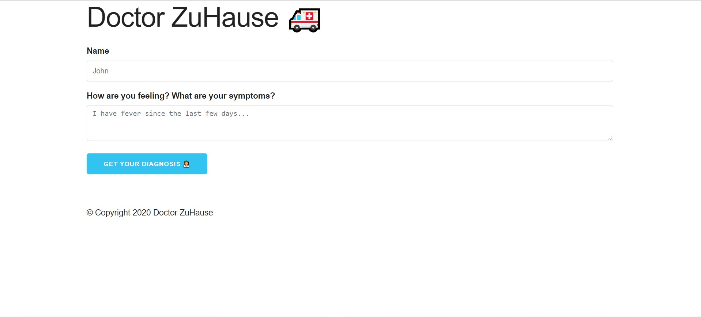

# NLP-Summit-Hackathon


Link to the competition: https://www.nlpsummit.org/hackathon/

Built using: Node, Express, EJS, Python.


## Use the repo
- Download the dataset from [Kaggle](https://www.kaggle.com/tboyle10/medicaltranscriptions).
- Where you want to clone this repo, open the cmd and type
```
git clone https://github.com/ekdnam/NLP-Summit-Hackathon.git
```
- Now in cmd type,
```
mkdir input
cd input
```
- Unzip the dataset to `input`

### Run server

```
cd app
npm run dev
```
